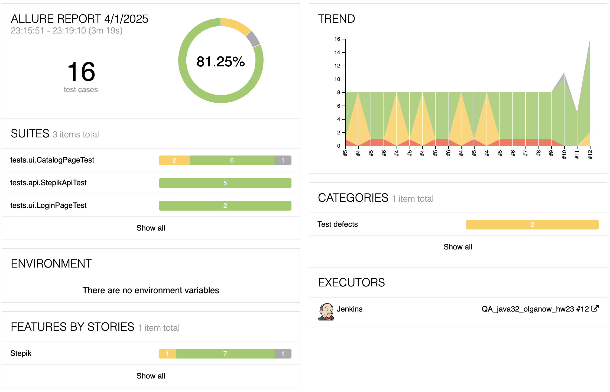
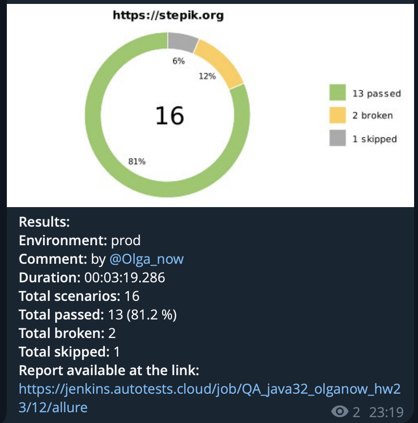

## Описание функционала

Это небольшой проект по автоматизации сайта онлайн-курсов "stepik"
https://stepik.org

### Тестирование

В данном проекте реализованы тесты:
- [x] UI :
  - searchByParamsTest - параметризированная проверка поиска по одному параметру
  - searchTwoParametersTest - параметризированная проверка поиска по двум параметрам
  - stepikCheckLocaleTest - параметризированная проверка локализации кнопок главного меню
  - validateAuthorisationFormTest - проверка компонентов страницы авторизации
  - cancelAuthorisationTest - проверка отмены авторизации

- [x] API:
  - getCourse - получение информации о курсе
  - getCourseNotFound - негативная проверка получения информации о курсе
  - getUserDetails - получение информации о пользователе
  - getUserNotFound - негативная проверка получения информации о пользователе
  - loginWithInvalidCredentials - негативная проверка авторизации

### Технологии


### Запуск

1. Запуск из Jenkins
https://jenkins.autotests.cloud/job/QA_java32_olganow_hw23/configure

2. Запуск тестов из консоли:
```
 ./gradlew clean api   
```

### Отчетность о запусках тестов

- [x] Allure отчет
  - Пример отчета:


- [x] Отчет о запуске в Telegram
  - Пример отчета:
  


