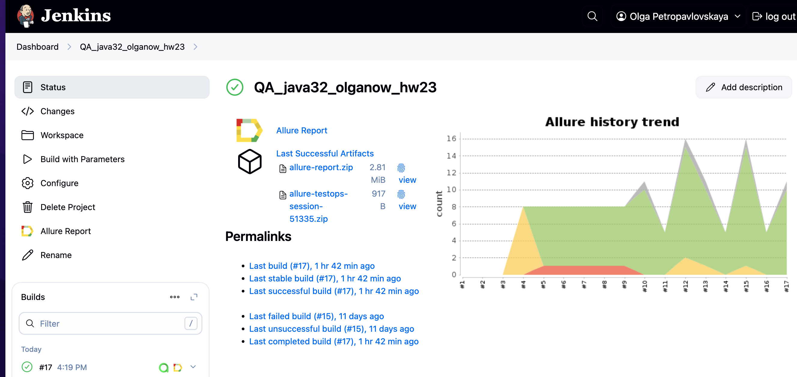
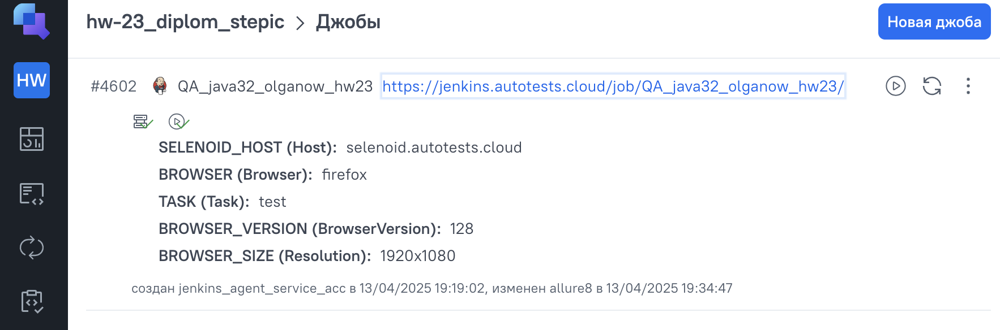
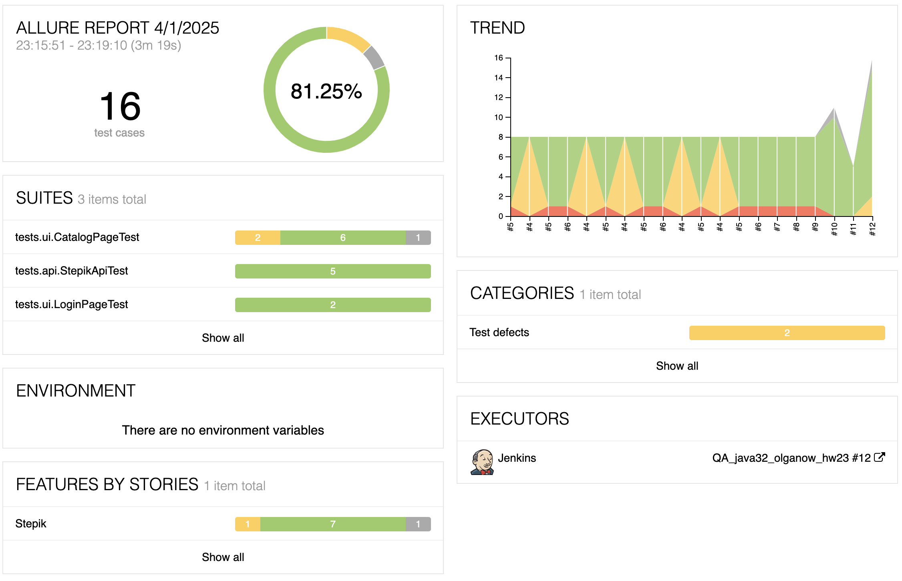
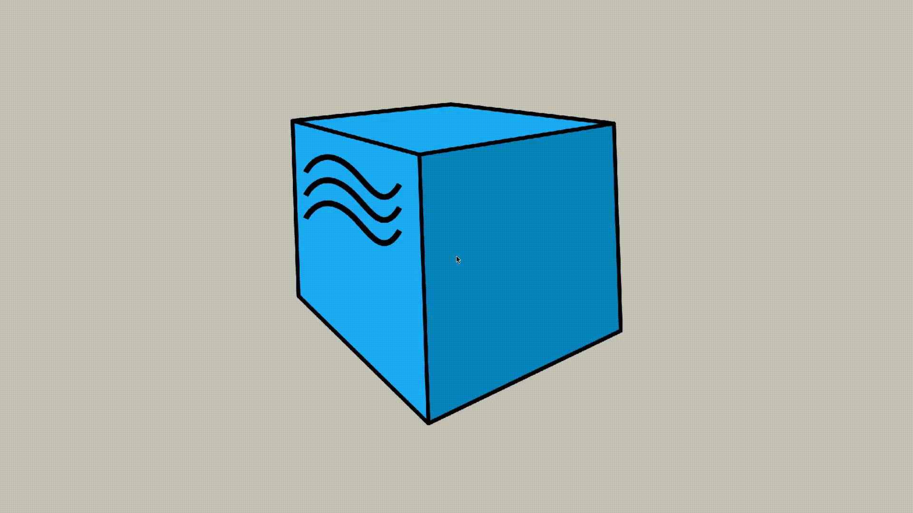
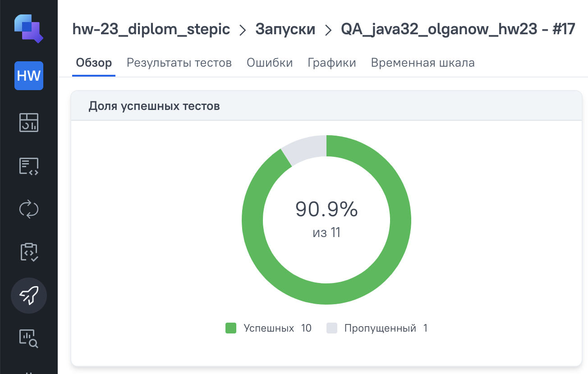
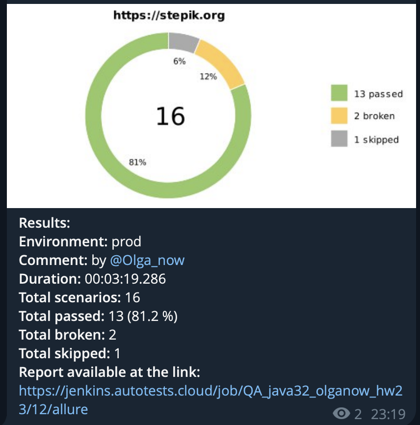

Это небольшой проект по автоматизации сайта онлайн-курсов "stepik"
https://stepik.org

# Содержание

1. [Описание функционала](#описание-функционала)
2. [Тестирование](#тестирование)
  - [UI тесты](#ui)
  - [API тесты](#api)
3. [Технологии](#технологии)
4. [Запуск](#запуск)
  - [Запуск из Jenkins](#запуск-из-jenkins)
  - [Запуск из Allure TestOps](#запуск-из-allure-testops)
  - [Запуск тестов из консоли](#запуск-тестов-из-консоли)
5. [Отчетность о запусках тестов](#отчетность-о-запусках-тестов)
  - [Allure отчет](#allure-отчет)
  - [Видео запуска теста](#видео-запуска-теста)
  - [TestOps отчет](#testops-отчет)
  - [Отчет о запуске в Telegram](#отчет-о-запуске-в-telegram)
6. [Тест-кейсы](#тест-кейсы)

## Описание функционала

Проект представляет собой комплексную систему автоматизированного тестирования, включающую как UI, так и API тесты для проверки функциональности образовательной платформы Stepik. 

Проект реализован с использованием современных подходов к автоматизации, включая:
- Параметризированные тесты для проверки различных сценариев
- Интеграцию с системами мониторинга и отчетности
- Автоматическое создание отчетов в различных форматах
- Интеграцию с CI/CD пайплайнами
- Автоматическую отправку уведомлений о результатах тестирования в Telegram

## Тестирование

В данном проекте реализованы тесты:
- [x] UI :
  - searchByParamsTest - параметризированная проверка поиска по одному параметру
  - searchTwoParametersTest - параметризированная проверка поиска по двум параметрам
  - stepikCheckLocaleTest - параметризированная проверка локализации кнопок главного меню
  - validateAuthorisationFormTest - проверка компонентов страницы авторизации
  - cancelAuthorisationTest - проверка отмены авторизации

- [x] API:
  - getCourse - получение информации о курсе
  - getCourseNotFound - негативная проверка получения информации о курсе
  - getUserDetails - получение информации о пользователе
  - getUserNotFound - негативная проверка получения информации о пользователе
  - loginWithInvalidCredentials - негативная проверка авторизации

## Технологии

[](https://www.java.com)
[](https://gradle.org)
[](https://selenide.org)
[](https://aerokube.com/selenoid)
[](https://junit.org/junit5)
[](https://docs.qameta.io/allure)
[](https://telegram.org)
[](https://www.jetbrains.com/idea)
[](https://www.jenkins.io)


## Запуск

1. Запуск из Jenkins
https://jenkins.autotests.cloud/job/QA_java32_olganow_hw23/configure



2. Запуск из allure testop:
https://allure.autotests.cloud/project/4712/jobs



3. Запуск тестов из консоли:
```
 ./gradlew clean api   
```

## Отчетность о запусках тестов

- [x] Allure отчет


https://allure.autotests.cloud/project/4712/dashboards

- [x] Видео запуска теста


https://jenkins.autotests.cloud/job/QA_java32_olganow_hw23/17/allure/#suites/907e863b9441e9e25c62507bfa8ae132/c392a97948804df8/

- [x] TestOps отчет
  
https://allure.autotests.cloud/launch/45814

- [x] Отчет о запуске в Telegram
  - Пример отчета:
  

## Тест-кейсы
1) Заголовок "Пользователь не сможет авторизоваться на сайте, если введет неверный пароль"
Шаги
* Перейти на сайт stepik.org
* Нажать на кнопку "Войти"
* Проверить заголовок формы входа на сайт
* Ввести email
* Ввести некорректный пароль
* Нажать кнопку "Войти"
Ожидаемый результат: Появилось сообщение "E-mail адрес и/или пароль не верны."

2) Заголовок "Форма авторизации закроется, если нажать на Х "
Шаги
* Перейти на сайт stepik.org
* Нажать на кнопку "Войти"
* Проверить заголовок формы входа на сайт
* Нажать кнопку "Х
Ожидаемый результат: Форма авторизации закрылась


